# O.A.T Vietnamese Cuisine

O.A.T Vietnamese Cuisine is an imaginary vietnamese restauraunt based in central London. The ideal is to provide londerners the most authentic vietnamese food with an website for staff to manage the daily menu and reply to customer reviews. It also allows customers to simply leave reviews to each dish on the menu list and view other's reviews. The average ratings of each menu item also gives both the staff and customers an idea of the most popular choices at O.A.T.
The live link can be found here: [Live Site - O.A.T Vietnamese Cuisine ](https://oat-vietnamese-cuisine-91aa08c21232.herokuapp.com/)

## Table of Contents
- [O.A.T Vietnamese Cuisine](#O.A.T Vietnamese Cuisine)
  - [Table of Contents](#table-of-contents)
- [User-Experience-Design](#user-experience-design)
  - [The-Strategy-Plan](#the-strategy-plan)
    - [Site-Goals](#site-goals)
    - [Agile Planning](#agile-planning)
      - [Epics](#epics)
      - [User Stories](#user-stories)
- [The-Scope-Plan](#the-scope-plan)
- [The-Structure-Plan](#the-structure-plan)
  - [Features](#features)
  - [Features Left To Implement](#features-left-to-implement)
- [The-Skeleton-Plan](#the-skeleton-plan)
  - [Wireframes](#wireframes)
  - [Database-Design](#database-design)
  - [Security](#security)
- [The-Surface-Plan](#the-surface-plan)
  - [Design](#design)
  - [Colour-Scheme](#colour-scheme)
  - [Typography](#typography)
  - [Imagery](#imagery)
- [Technolgies](#technolgies)
- [Testing](#testing)
- [Deployment](#deployment)
  - [Version Control](#version-control)
  - [Heroku Deployment](#heroku-deployment)
  - [Run Locally](#run-locally)
  - [Fork Project](#fork-project)
- [Credits](#credits)

# User-Experience-Design

## The-Strategy-Plan

### Site-Goals
The site is aimed for restaurant staff to easily manage the daily menus on the website, keep track of the costomers' feedbacks to monitor the quality of the food and reply to each review for better customer care pratice. 

The site also aims to provide customers the opportunity to leave reviews and make suggestions to the restaurant menus. They can also rate the food from 1 to 5 based on their experience and an average rating is automatically generated for indival dish. 

### Agile Planning

This project was developed through applying agile methodologies by delivering small features in incremental sprints.

All projects were assigned to epics, which were broken into small tasks and prioritized as must have, should have, could have. "Must have" stories were completed first before "should haves", and the last "could haves". To ensure all core requirements completed first gives a complete product, with the nice to have features being added if the time frame allows.

#### Epics

The project had 8 main Epics (milestones):

**EPIC 1 - Base Setup**

The base setup epic was the first epic to be delivered as all other features depend on the completion of the base setup.

**EPIC 2 - Small Pages**

Instead of creating epics for tiny features, all the small pages were included to this epic.

**EPIC 3 - Authentication Epic**

The authentication epic is for all stories related to the registration, login and authorization of views. It allows restaurant staff to CRUD menus and reply to user’s reviews securely and users to leave their messages after signed in.

**EPIC 4 - Menu**

The menu epic is for all stories that relate to the creating, editing, toggling, deleting, and viewing of menus. This allows for regular users to view menus and for staff to manage them with a simple UI interface.

**EPIC 5 – Reviews and Ratings**

The Reviews epic is for all stories related to creating, viewing the reviews and ratings to displayed menus at website. This allows the site users to easily view feedbacks of individual menu and also for signed in customers to leave reviews and ratings.

**EPIC 6 - Reply**

The Reply epic is for all stories related to creating, viewing the replies to customers’ reviews. This allows the site users to view the reply messages and also the restaurant staff to reply to user’s feedbacks.

**EPIC 7 - Deployment Epic**

This epic is for all stories related to deploying the app to heroku so that the site is live for staff and customer use.

**EPIC 8 - Documentation**

This epic is for all documents related stories and tasks to document the lifecycle of the project development. It aims to record the detailed documentations to all stages of development and necessary information on testing, deploying and running the application.

#### User Stories

The following user stories (by epic) were completed over the 3 sprints:

**EPIC 1 - Base Setup**

As a developer, I can create the base.html including navbar and footer as the basic structure so that other template pages can be extended based on it.

As a developer, I can create static resources so that images, css and javascript can be loaded and user templates can be styled and responsive to users.

As a developer, I can set up the project so that the core features can be implemented.

**EPIC 2 - Small Pages**

As a developer, I can implement a 404 error page to inform users that the page they accessed doesn't exist.

As a developer, I can implement a 500 error page to inform users when an internal server error occurs.

As a developer, I can implement a 403 error page to redirect users from unauthorised access, so that I can secure my views.

As a restaurant owner, I can have a home page so that customers can view restaurant information and navigate to the relevant web pages.

**EPIC 3 - Authentication Epic**

As a developer, I can implement allauth so that users can sign up and have access to the websites features.

As a user, I can receive messages when I register/login/logout an account so that I can know the actions are conducted successfully.

**EPIC 4 - Menu**

As a user, I can view menus so that I can decide if I would like to dine at the restaurant.

As a staff user, I can add a new menu when we have new dishes to offer.

As a staff user, I can create draft of a potential new menu so that I can display it to users later when it is confirmed.

As a staff user, I can edit a menu when updates are required.

As a staff user, I can toggle/hide a menu when it’s temperately not available for a particular day because shortage of the ingredients. 

As a staff user, I can delete a menu when it is not ordered for a reasonable period of time.

As a staff user, I can receive messages when I manage menus so that I can know the actions are conducted successfully.

**EPIC 5 – Reviews and Ratings**

As a user, I can leave comments on dishes so that I can share my experience with others/give improvement suggestions to restaurant owner

As a user, I can give a rating to a dish so that I can express how much I like/dislike it. 

As a user, I can view other’s feedbacks and ratings to menus so that I can decide what to order and what to avoid.

As a site owner, I can view the feedbacks and ratings of my menu list so that I can know how well the menus work to customers.

As a user, I can receive messages when I submit a review so I know it was completed successfully.

**EPIC 6 – Reply**

As a staff user, I can reply to users’ reviews so that I can let customers know we care about their experience with us.

As a user, I can view the replies from the restaurant so that I can see if they are responsible owner. 

As a staff user, I can receive messages when I reply to a review so I know it was completed successfully.

**EPIC 7 - Deployment Epic**

As a developer, I can deploy the project to heroku so that it is live for customers

**EPIC 7 - Documentation**

Tasks:

* Complete readme documentation
* Complete testing documentation

## The-Scope-Plan

* Responsive Design - Site should be fully functional on all devices from 320px wide up.
* Ability to perform CRUD functionality on Menus, create and read functions on reviews and replies.
* Restricted role based features with allauth accounts setting up
* Home page with hero images implying the name of the restaurant and their believe
* Contact page with contact, opening and location information

## The-Structure-Plan

### Features

**Home Page**

``USER STORY - As a restaurant owner, I can have a home page so that It can best represent the business and allow customers to navigate from there.

*1. Navigation Menu*

``USER STORY - As a developer, I can have the navbar so that users can navigate the website from any device``

Implementation:

 The Navigation contains links for Home, Menu, Reviews, Register, Login and Contact.
  * Home -> index.html - Visible to all
  * Menu -> menu_list.html
  * View Menus -> menu_list.html - Visible to all
    * View Details -> menu modal - Visible to all
    * Add Menu -> add_menu.html - Visible to staff
    * Edit Menu -> edit_menu.html - Visible to staff
    * Hide and Delete Menu -> links - Visible to staff
    * Leave Review -> leave_review.html - Button Visible to all but page accessible by logged in users only; Unlogged in users will be directed to login -> login.html

  * Reviews -> reviews.html
    * View Reviews & Average Ratings -> reviews.html - Visible to all
	    * View Details & Rating -> review_details.html -   
        Visible to all
		   * Reply -> reply.html – Visible to staff
    
  * Login -> login.html - Visible to logged out users
  * Register -> signup.html - Visible to logged out users
  * Logout -> logout.html - Visible to logged in users
  * Contact -> contact.html - Visible to all 

The navigation menu is displayed on all pages and collapsed into a hamburger menu on smaller devices. This will allow users to view the site from any device.

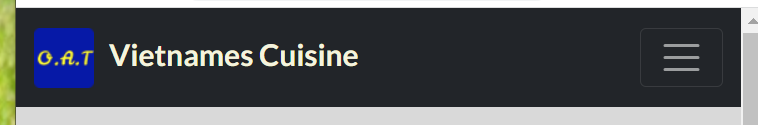

*2. Hero Images*

``USER STORY - As a restaurant owner, I would like hero images at home page so that it can deliver the business concept and purpose to site users``

Implementation:

The home page contains rotating hero images which representing their individual messages:
- “Original Ingredients”
- “Authentic Recipe”
- “Traditional Method”. 

The first letter of each phrase is highlighted in purple, which forms the restaurant name ``O.A.T``. This immediately make it evident to the user, what the purpose and believe of the website is.

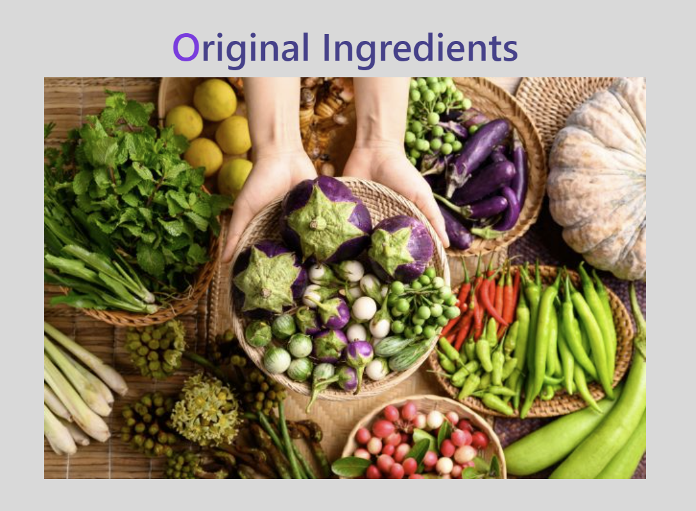

*3.Footer*

``USER STORY - As a developer, I can create the footer with company copyright information``

Implementation:

A footer has been added to the bottom of the site, this contains copyright information.

**View Menu Page**

``As a user, I can view menu list so that I can decide if I would like to dine at the restaurant``

Implementation:

A menu page has been implemented to allow users to see the current active menus and decide whether they are interested in the food offered. This is visible to all users regardless of logged in status. There is a ``view Details`` button next to each menu to access the menu modal for ingredients and allergies information. 
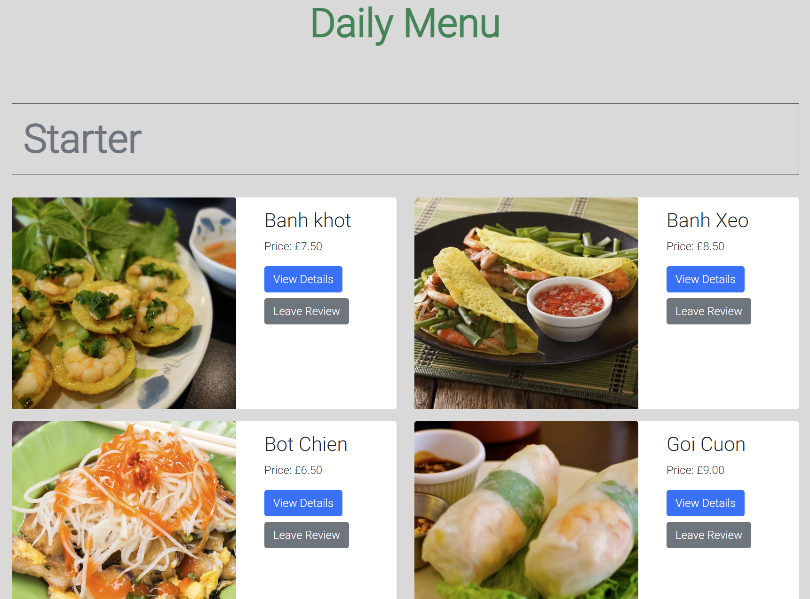

**Add Menu Page**

*User Story*
- ``As a staff user, I can add a new menu when we have new dishes to offer``
- ``As a staff user, I can create draft of a potential new menu so that I can display it to users later when it is confirmed``
- ``As a staff user, I can receive messages when I manage menus so that I can know the actions are conducted successfully``

Implementation:

-	An add menu page was implemented to allow staff users to add new menus via the UI without having to use the backend admin panel. 
-	``Add Menu`` link underneath the Daily Menu title is visible after staff logged in. This direct staff to ``Add Menu`` form to add a dish.

-	At the add menu form, the Menu status is default as ``Draft``. Only after staff manually change it to ``Approved``, the added menu can appear at the Menu List page.

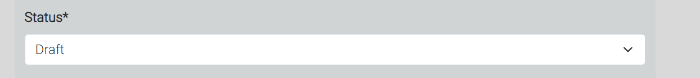
-	A flash message appears after a menu is added.
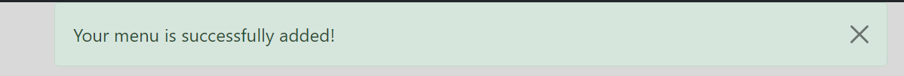
-	If nun-staff try to access add-menu page through its URL address, they will be directed to a customized 403 page.

**Edit Menu Page**

*User Story*
- ``As a staff user, I can edit a menu when updates are required``

Implementation:

-	An edit menu page was implemented to allow staff users to edit existing menus via the UI without having to use the backend admin panel. 
-	``Edit Menu`` link underneath each menu image is visible after staff logged in. This direct staff to ``Edit Menu`` form to edit a dish.
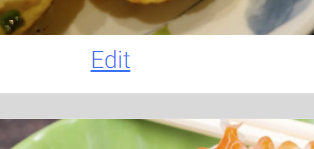
-	A flash message appears after a menu is added.
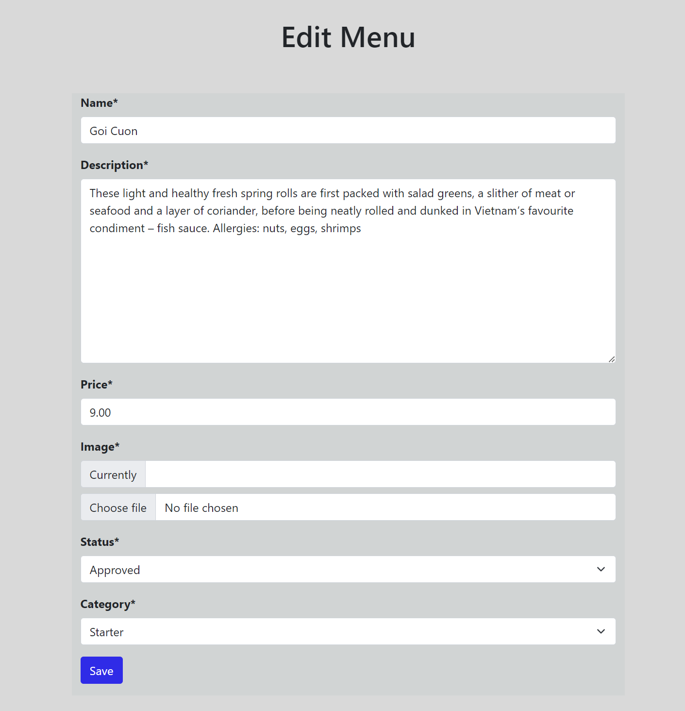

-	If nun-staff try to access edit-menu page through its URL address, they will be directed to a customized 403 page.

**Other Menu Manage Features Hide & Delete**

*User Story*
- ``As a staff user, I can toggle/hide a menu when it’s temperately not available for a particular day because shortage of the ingredients``
- ``As a staff user, I can delete a menu when it is not ordered for a reasonable period of time``

Implementation:

-	The hide and delete features have been implemented at menu page next to `Edit`.
-	By clicking on ``Hide``, this particular menu will be temperately removed off the list. And Hide become ``Unhide``. The same way to unhide a menu when requires, and the text changes to ``Hide``.
-	By clicking on ``Delete``, this particular menu will be permanently removed off the list.
-	A confirmation message will appear after the actions are performed successfully.

**View Reviews Page**
**View Review Detail Page**

*User Story*
- ``As a user, I can view other’s feedbacks and ratings to menus so that I can decide what to order and what to avoid``

- ``As a site owner, I can view the feedbacks and ratings of my menu list so that I can know how well the menus work to customers``

Implementation:

-	After navigating through navbar menu to ``Reviews``, users can view each menu item with total number og reviews and a average rating score displayed in yellow stars if users reviewed it. 

-	A review details page can be accessed at reviews page by clicking on the review ‘number’ under the menu image. 
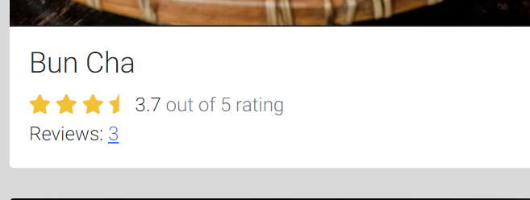
-	It will direct all the users to the detailed reviews and ratings page for a particular dish from the menu list.

**Create Review and Rating Page**

*User Story*
- ``As a user, I can leave comments on dishes so that I can share my experience with others/give improvement suggestions to restaurant owner``
- ``As a user, I can give a rating to a dish so that I can express how much I like/dislike it``
- ``As a user, I can receive messages when I submit a review so I know it was completed successfully``

Implementation:

-	At menu page there is a grey button ``Leave Review`` next to each menu. 
-	By clicking on it, logged in users will be directed to a ``Leave Review`` page where they can leave comments and rating.
 
-	Un-logged in users will be directed to ``Login`` page. After login, users will then be directed back to the ``Leave Review`` page for the particular item they chose earlier.

-	A flash message appears after a review is submitted.
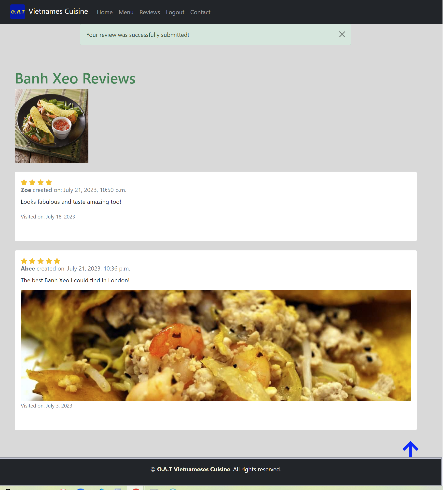

**Create Reply page**

*User Story*
- ``As a staff user, I can reply to users’ reviews so that I can let customers know we care about their experience with us``
- ``As a staff user, I can receive messages when I reply to a review so I know it was completed successfully``

Implementation:

-	A reply page was implemented with a form that allows staff users to reply to reviews left by customers through the UI. 
-	After staff logged in, a ``Reply`` button became visible and redirect the staff user to reply page.

-	A flash message appears after a reply is submitted.

-	If nun-staff try to access reply page through its URL address, they will be directed to a customized 403 page.

**Authentication pages**

*User Story*
- ``As a developer, I can implement allauth so that users can sign up and have access to the websites features``

- ``As a user, I can receive messages when I register/login/logout an account so that I can know the actions are conducted successfully``

Implementation:

**Register Page**

-	A register page was implemented to allow user to create an account with O.A.T. 

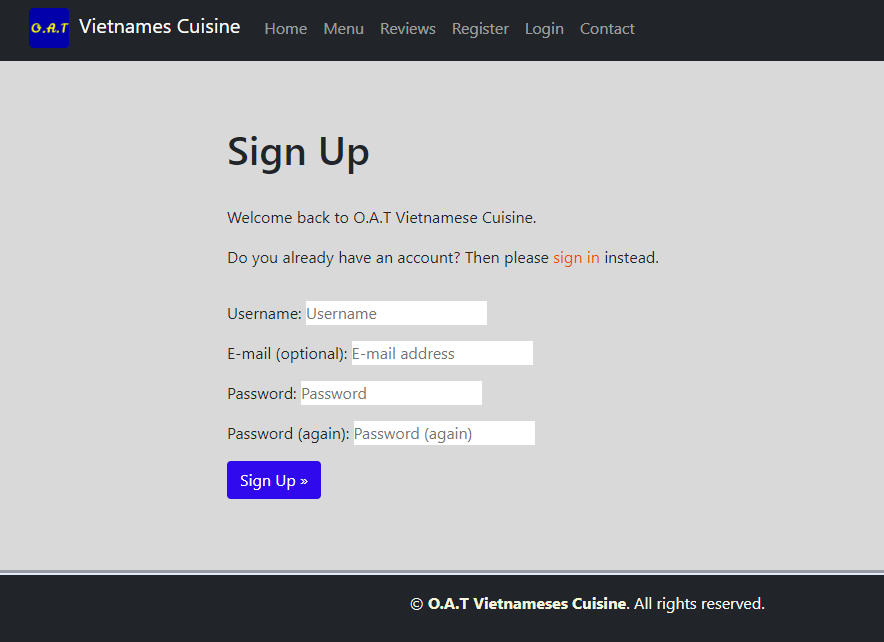

**Login Page**

-	A Login page was implemented to allow users to sign in their account safely before performing certain activities. 

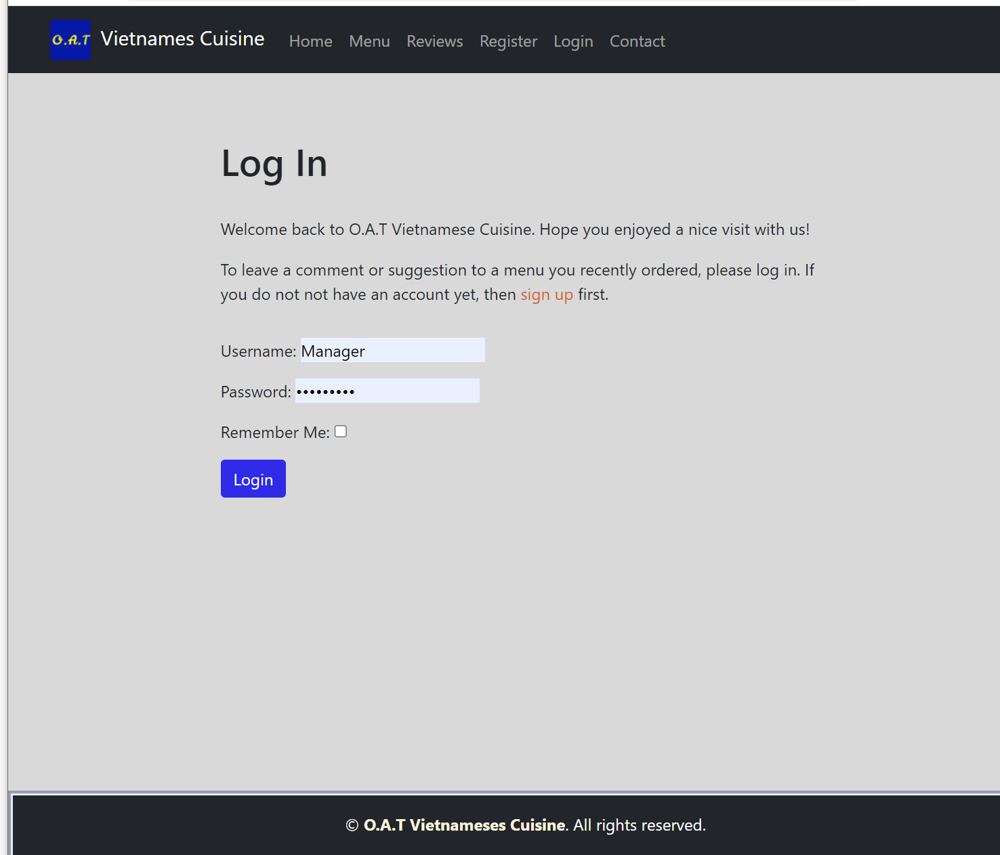

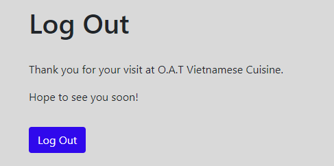

**Contact Page**

    - A separate contact page was implemented with Address, Opening time, Contact Details and iframed Google Map.

  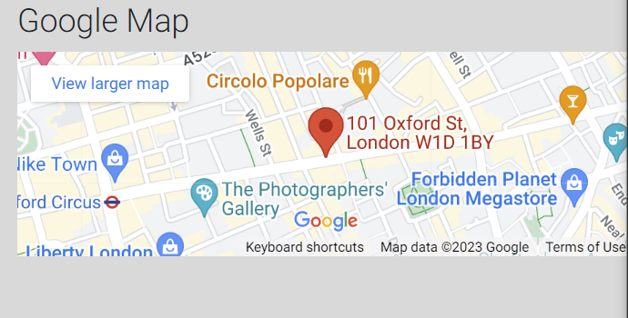

    - Contact details were featured with dial and mailto functions for a better user experience.
  

**Back to Top**

- A Back to Top icon was implemented at the menu-list, reviews and review details pages.
- For longer pages, it would allow users to get back to top of the page easily.
    

**Favicon**

    - A site wide favicon was implemented.
    - This provides an image in the tabs header to allow the user to easily identify the website if they have multiple tabs open.

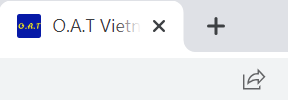

**Error Pages**

*User Story*
- ``As a developer, I can implement a 404 error page to alert users when they have accessed a page that doesn't exist``

Implementation:

**404 Page**

-	A 404 page has been implemented and will display if a user navigates to a broken link.

-	This customised 404 page will allow the user to easily navigate back to the main website by click on the ``Home`` button.

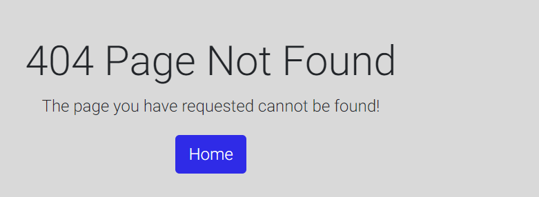

*User Story*

- ``As a developer, I need to implement a 403 error page to alert users when accessing a page/view that they do not have permission to``

Implementation:

**403 Page**

-	A 403 error page has been implemented to provide feedback to the user when they try to access unauthorized content. 
-	Users will be directed to this page if they alter the URL's and attempt to edit, delete or access pages that are restricted. 

This covers:

* Add Menu - Only authorized to staff
* Edit Menu - Only authorized to staff
* Add Review - Only authorized to the customer who is logged in or Staff
* Reply Review - Only authorized to staff

*User Story*
- ``USER STORY - As a developer, I need to implement a 500 error page to alert users when an internal server error occurs``

Implementation:

**500 Page**

-	A 500 error page has been displayed to alert users when an internal server error occurs. 
-	The message suggests the user to try it later. 

### Features Left To Implement
- In a future release I would like to implement a user center page. 
- From there, user can view their own reviews, saved dishes which they liked.
- User can also book a table, view and manage their bookings from there. 

